# Reverin shapes #

## Инструкция ##

Сборник магических фигур. Формирует куб, шар или пирамиду любого размера из блоков.

* Призывается: am biblio reverin_shapes

* Выполняется: am !(длина/радиус) *(материал) **(цвет) >(форма)

* Формы: cube, ball, pyramid.

* Цель-координата указывает на центр фигуры.

* Пример :

  ```cadabra
  am !kvin u modi *alabastrum **sapfirum >cube
  ```

  > создаёт куб длиной пять из синего бетона.

* Цвет можно не указывать.

* Если не указать название блока, то необходимый материал будет забираться из рук.

***

## Заклинание ##

Ниже будут приведены скриншоты, демонстратирубщие этапы выполнения заклинания. В них блоками шерсти отмечены перемещения активной цели.

Обозначение цветов :

> В порядке времени, начиная с текущей

* Желтая
* Синия
* Красная
* Серая (в качестве обазначения)

>**ВНИМАНИЕ!** Для избежание повторных изьяснений, описание модулей: BALL, PYRAMID будет опираться на описание модуля CUBE.

***

## Создание CUBE ##

### Информация CUBE ###

* Используется цель Т(a)

* Используемые перменные :

  |CadabraCod| Псевдокод |   Название   |
  |----------|-----------|--------------|
  | !!       | length    |длина         |
  | \*       | block     |название блока|
  | \*\*     | type      |тип блока     |

### Код CUBE ###

Слева - исходное заклинание, справа псевдокод.

```cadabra
1  CUBE:                    |  T(a) = (0, 0, 0)
2    !! ekvivax !           |  !length = $power;
3    !unu luft              |  $power = 1; $luft = 1;
4    ! ekvivax !!           |  $power = length;
5    ! minux unu            |  $power--;
6    ! fraktix du           |  $power/=2;
7    d modi sw modi         |  (x-, y-, z-);      //смотрите скрин. 1
8    ! ekvivax !!           |  $power = !length;
9    cyklix                 |  for
10     cyklix               |    for
11       cyklix             |      for
12         * materium **    |        *block materium *type;
13         !unu n modi      |        $power = 1; (x, y+1, z);
14       reprizix           |      end
15       e modi             |      (x+1, y, z)
16       ! ekvivax !!       |      $power = !length;
17       s modi             |      (x, y-, z)     //смотрите скрин. 2
18     reprizix             |    end
19     !unu u modi          |    $power = 1; (x, y, z+1);
20     ! ekvivax !!         |    $power = !length;
21     w modi               |    (x-, y, z)       //смотрите скрин. 3
22   reprizix               |  end
23 <                        |  //возвращение (смотрите скрин. 4)
```

Этапы строительства:

> Длина равна 5.

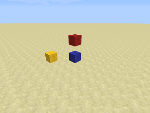
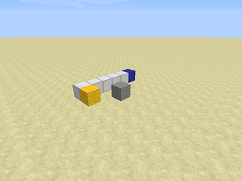
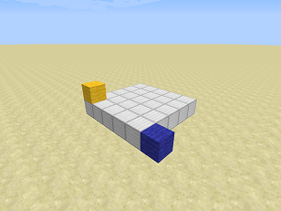
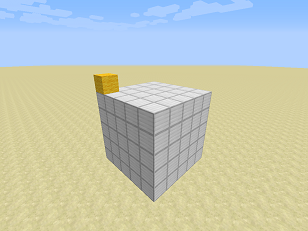

### Описание CUBE ###

Этот модуль можно разделить на четыре состовляющие :

* Начало (подготовка) - перемещение цели Т(а) на крайний югозападный нижний блок и сохранение длины куба.

* Второй вложенный цикл - создание линии заданных блоков с юга на север в длину куба.

* Первый вложенный цикл - перемещение Т(а) на изначальную позицию по оси юг-север (в южное направление), смещенную на восток в один блок.

* Основной цикл - перемещение Т(а) на изначальный юго-западный блок куба, смещенный на один блок вверх.

Все три цикла выполняются столько раз, на сколько задана длина куба, из чего получаем по истечению всех трех циклов построенный куб.

***

## Создание BALL ##

### Информация BALL ###

* Используется цель Т(a)

* Используемые перменные :

  |CadabraCod|   Псевдокод   |        Название       |
  |----------|---------------|-----------------------|
  | !x12     | radius        | радиус                |
  | !x8      | distance      | дистанция             |
  | !x6      | curr_distance | текущая дистация      |
  | !x7      | temp          | временная переменная  |
  | !x3      | x             | длина                 |
  | !x4      | y             | ширина                |
  | !x5      | z             | высота                |
  | !x9      | sw_l          | переключатель для l   |
  | !x10     | sw_w          | переключатель для w   |
  | !x11     | sw_h          | переключатель для h   |
  | \*       | block         | название блока        |
  | \*\*     | type          | тип блока             |

  * *radius* - радиус шара, задаваемый пользователем.

  * *distance* - максимальная возможное растояние блока от центра шара в квадрате (= радиус в квадрате).

  * *curr_distance* - текущее растояние в квадрате, высчитывается по формуле = x^2 + y^2 + z^2

  * *x, y, z* - длина, ширина, высота соответственно. Хранят значения *"отклонения"* от центра шара.

  * *temp* - вспомогательная переменная для расчета *curr_distance*.

  * *sw_x, sw_y, sw_z* - переключатели для длины, ширины, высоты соответственно. В описании заклинании указывается их значение.

### Код BALL ###

Слева - исходное заклинание, справа псевдокод.

```cadabra
1   BALL:                               |  T(a) = (0, 0, 0)
2   !!!!!!!!!!!! ekvivax !              |  !radius = $power;
3   !! ekvivax !                        |  !diameter = $power;
4   !unu luft                           |  $power = 1; $luft = 1;
5   !kvin intervax                      |  $intervax = 5;
6   ! ekvivax !!                        |  $power = !diameter;
7   !!!!!!!! ekvivax !                  |  !distance = $power;
8   !!!!!!!! multiplux !!!!!!!!         |  !distance *= !distance;
9   d modi sw modi                      |  (x-, y-, z-);        //смотрите скрин. 1
10  !!! ekvivax !                       |  !y = $power;
11  !!!! ekvivax !                      |  !x = $power;
12  !!!!! ekvivax !                     |  !z = $power;
13  ! multiplux du                      |  $power *= 2;
14  ! plux unu                          |  $power++;
15  !! ekvivax !                        |  !diameter = $power;
16  cyklix                              |  for
17    !!!!!!!!!!unu                     |    !sw_x = 1;
18    cyklix                            |    for
19      !!!!!!!!!unu                    |      !sw_y = 1;
20      cyklix                          |      for
21        !!!!!! ekvivax !!!            |        !curr_distance = !y;
22        !!!!!! multiplux !!!!!!       |        !curr_distance *= !curr_distance;
23        !!!!!!! ekvivax !!!!          |        !temp = !x;
24        !!!!!!! multiplux !!!!!!!     |        !temp *= !temp;
25        !!!!!! plux !!!!!!!           |        !curr_distance += !temp;
26        !!!!!!! ekvivax !!!!!         |        !temp = !z;
27        !!!!!!! multiplux !!!!!!!     |        !temp *= !temp;
29        !!!!!! plux !!!!!!!           |        !curr_distance += !temp;
30        !!!!!! prevalix !!!!!!!!      |        if (!curr_distance <= !distance)
31        * materium **                 |          *block materium *type;
32        .                             |        end
33        !unu n modi                   |        $power = 1; (x, y+1, z);
33        !!! prevalix nulo             |        if (!y <= 0)
34        !!!!!!!!!nulo                 |          !sw_y = 0;
35        . . .                         |        end
36        !!!!!!!!! identix unu         |        if (!sw_y <> 1)
37        !!! plux unu                  |          !y++;
38        ignorix                       |        else
39        !!! minux unu                 |          !y--;
40        . .                           |        end
41      reprizix                        |      end
42      !!! ekvivax !!!!!!!!!!!!        |      !y = !radius;
43      !unu e modi                     |      $power = 1; (x+1, y, z);
44      ! ekvivax !!                    |      $power = !diameter;
45      s modi                          |      (x, y-, z);
46      !!!! prevalix nulo              |      if (!x <= 0)
47      !!!!!!!!!!nulo                  |        !sw_x = 0;
48      . . .                           |      end
49      !!!!!!!!!! identix unu          |      if (!sw_x <> 1)
50      !!!! plux unu                   |        !x++;
51      ignorix                         |      else
52      !!!! minux unu                  |        !x--;
53      . .                             |      end
54    reprizix                          |    end
55    !!!! ekvivax !!!!!!!!!!!!         |    !x = !radius;
56    !unu u modi                       |    $power = 1; (x, y, z+1);
57    ! ekvivax !!                      |    $power = !diameter;
58    w modi                            |    (x-, y, z);        //смотрите скрин. 2
59    !!!!! prevalix nulo               |    if (!z <= 0)
60    !!!!!!!!!!!nulo                   |      !sw_z = 0;
61    . . .                             |    end
62    !!!!!!!!!!! identix unu           |    if (!sw_z <> 0)
63    !!!!! plux unu                    |      !z++;
64    ignorix                           |    else
65    !!!!! minux unu                   |      !z--;
66    . .                               |    end
67  reprizix                            |  end
68  <                                   |  //возвращение (смотрите скрин. 6 )
```

> Радиус равен 3.

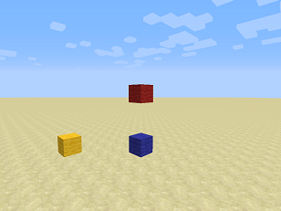
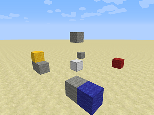
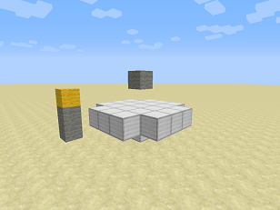
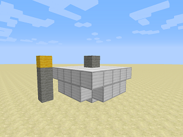
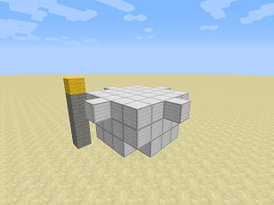
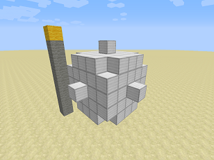

### Описание BALL ###

Модуль BALL имеет ту же структуру, что и CUBE.

При помощи все тех же 3-х циклов заклинание проходит по виртуальному кубу равному 2*радиусу, заданным пользователем, центр которого совпадает с центром шара.

Главное отличие от работы модуля CUBE в том, что создание блока будет при условии, что растояние Т(а) от центра не больше радиуса шара.

Растояние высчитывается по следующей формуле = (x^2+y^2+z^2)^1/2, если первая координата равна (0, 0, 0) (наш сучай). Из этого получаем условие создание блока : (x^2+y^2+z^2)^1/2 <= radius. Для упрощение приведем к виду x^2+y^2+z^2 <= radius*radius.

Как вы уже заметили, заклианием используются эти переменные : x, y, z. Каждая меняется в своем цикле в соответствии изменению Т(а) :

* y - второй вложенный
* x - первый вложенный
* z - основной

Отступление: изначально Т(а) - самый удаленный блок от центра, по сути он имеет координаты края куба, если бы его центр был центр шара и длина его = радиус*2. Вследствии этого изначально значения x, y, z = radius.

В ходе движения мы неизменно приближаемся к одной из центральных осей, поэтому переменные уменьшаются на единицу с каждым шагом (каждая в своем цикле). Но после прохождение этой оси переменная должна будет увеличиваться на единицу. Для достижение это цели существуют вспомогательные переменные : sw_x, sw_y, sw_z - дословно "переключатель x\\y\\z".

По достижению своей оси : ox для x, oy для y, oz для z, принимают значение 0. В этот момент меняется состояние переключателя, из-за чего переменные x, y, z теперь увеличиваются на единицу, конечно же каждая в своем цикле :

Поскольку координаты x, y часто перемещаются на изначальную позицию, их значения возвращаются к исходному, ровно как и их переключатели.

Так в ходе действия заклинания мы можем высчитывать растояние до центра и делать сопутствующую проверку принадлежность блока шару. По окончанию заклинания получаем построенный шар.

***

## Создание PYRAMID ##

### Информация PYRAMID ###

 Используется цель Т(a)

* Используемые перменные :

  |CadabraCod| Псевдокод |   Название   |
  |----------|-----------|--------------|
  | !!       | length    |длина         |
  | \*       | block     |название блока|
  | \*\*     | type      |тип блока     |

### Код PYRAMID ###

Слева - исходное заклинание, справа псевдокод.

```cadabra
1   PYRAMID:                |  T(a) = (0, 0, 0)
2   !! ekvivax !            |  !length = $power
3   !unu luft               |  $power = 1; $luft = 1;
4   ! ekvivax !!            |  $power = !length;
5   ! minux unu             |  $power--;
6   ! fraktix du            |  $power /= 2;
7   sw modi                 |  (x-, y-, z);    //смотрите скрин. 1
8   ! ekvivax !!            |  $power = !length;
9   cyklix                  |  for
10    cyklix                |    for
11      cyklix              |      for
12        * materium **     |        *block materium *type;
13        !unu n modi       |        $power = 1; (x, y+1, z);
14      reprizix            |      end
15      e modi              |      (x+1, y, z);
16      ! ekvivax !!        |      $power = !length;
17      s modi              |      (x, y-, z);    //смотрите скрин. 2
18    reprizix              |    end
19    w modi                |    (x-, y, z);
20    !unu u modi ne modi   |    (x+1, y+1, z+1);
21    !! minux du           |    !length -= 2;
22    ! ekvivax !!          |    $power = !length;    ////смотрите скрин. 3
23  reprizix                |  end
24  <                       |  //возвращение (смотрите скрин. 4)
```

Этапы строительства:

> Длина равна 5.

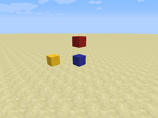
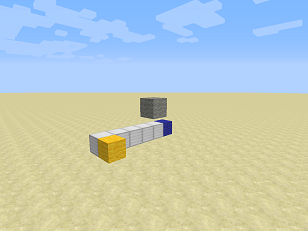
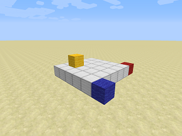
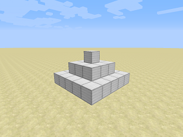

### Описание PYRAMID ###

Работает данный модуль чуть ли не в точь точь как модуль CUBE.

Различие в том, что цель Т(а) в основном цилке также сдвигается ближе к центру на один блок по координатам x и y, также из переменной length вычитается два. Получившиеся длина запоминается в power, в связи с чем два вложенных цикла выполняются на два раза меньше.

По итогу выполнения этих циклов мы получаем построенный квадрат, который меньше по отношению предыдущего.

В конце концов length будет равно 0 и два вложенных цикла перестанут работать, но основной продолжит работу, несмотря на то, что пирамида построена.

> Так как в основном цилке не происходит построение, пирамида от этого не пострадает, но цель Т(а) будет смещенна, из-за чего рекомендуется сбросить ее.

***

## Заключение ##

Заклинание актуально на момент 26.08.2019 версия 1.12.2

Автор заклинания : **Reverin**

Описание : **Anatoliy57**

***

## Исходник ##

```cadabra
am CUBE: !! ekvivax ! !unu luft ! ekvivax !! ! minux unu ! fraktix du d modi sw modi ! ekvivax !! cyklix cyklix cyklix * materium ** !unu n modi reprizix e modi ! ekvivax !! s modi repnizix !unu u modi ! ekvivax !! w modi reprizix < 

BALL: !!!!!!!!!!!! ekvivax ! !! ekvivax ! !unu luft !kvin intervax ! ekvivax !! !!!!!!!! ekvivax ! !!!!!!!! multiplux !!!!!!!! d modi sw modi !!! ekvivax ! !!!! ekvivax ! !!!!! ekvivax ! ! multiplux du ! plux unu !! ekvivax ! cyklix !!!!!!!!!!unu cyklix 

!!!!!!!!!unu cyklix !!!!!! ekvivax !!! !!!!!! multiplux !!!!!! !!!!!!! ekvivax !!!! !!!!!!! multiplux !!!!!!! !!!!!! plux !!!!!!! !!!!!!! ekvivax !!!!! !!!!!!! multiplux !!!!!!! !!!!!! plux !!!!!!! !!!!!! prevalix !!!!!!!! * materium ** . !unu n modi !!! 

prevalix nulo !!!!!!!!!nulo . . . !!!!!!!!! identix unu !!! plux unu ignorix !!! minux unu . . reprizix !!! ekvivax !!!!!!!!!!!! !unu e modi ! ekvivax !! s modi !!!! prevalix nulo !!!!!!!!!!nulo . . . !!!!!!!!!! identix unu !!!! plux unu ignorix !!!! 

minux unu . . reprizix !!!! ekvivax !!!!!!!!!!!! !unu u modi ! ekvivax !! w modi !!!!! prevalix nulo !!!!!!!!!!!nulo . . . !!!!!!!!!!! identix unu !!!!! plux unu ignorix !!!!! minux unu . . reprizix < 

PYRAMID: !! ekvivax ! !unu luft ! ekvivax !! ! minux unu ! fraktix du sw modi ! ekvivax !! cyklix cyklix cyklix * materium ** !unu n modi reprizix e modi ! ekvivax !! s modi reprizix w modi !unu u modi ne modi !! minux du ! ekvivax !! 

reprizix < 
```

***

>[Каталог](../../Список%20заклинаний.md)
